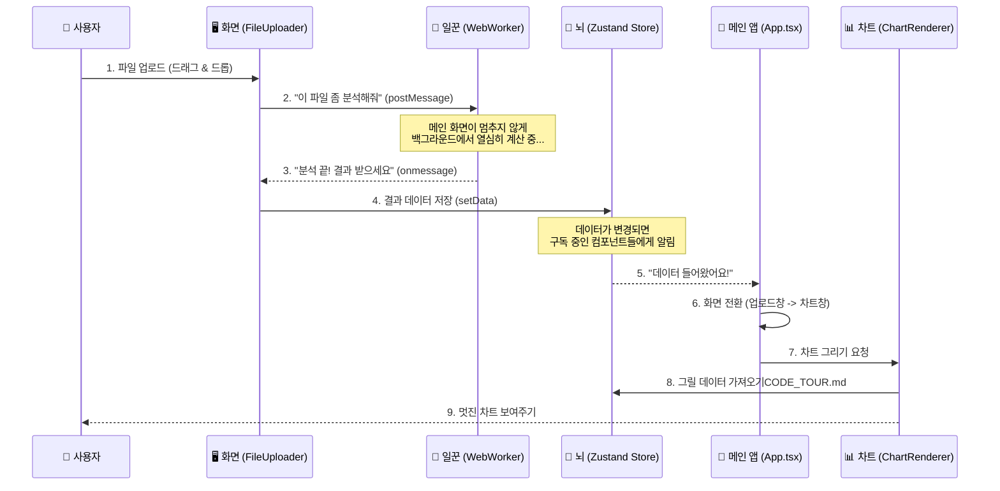

# 🗺️ 코드 투어: 이 앱은 어떻게 작동하나요?

Vite, TypeScript, Node.js가 낯선 분들을 위해, 이 프로젝트가 어떻게 구성되어 있고 데이터가 어떻게 흐르는지 쉽게 설명해 드립니다.

## 1. 기술 스택 비유 (요리 비유 🍳)

이 웹 애플리케이션을 **'레스토랑'**이라고 생각해 보세요.

- **Node.js**: **주방 시설**입니다. 요리(코드 실행)를 할 수 있는 환경을 제공합니다.
- **Vite**: **최첨단 조리 도구**입니다. 아주 빠르게 재료를 다듬고 요리를 준비해서 손님(브라우저)에게 내놓습니다. 개발할 때 수정 사항을 바로바로 보여주는 아주 빠른 도구입니다.
- **TypeScript**: **엄격한 레시피**입니다. "소금은 1티스푼만 넣으세요"처럼 재료와 양(데이터 타입)을 정확히 지키지 않으면 요리하기 전(컴파일)에 미리 경고해 줍니다. 실수를 방지해 줍니다.
- **React**: **레고 블록**입니다. 버튼, 화면, 그래프 같은 요소들을 블록처럼 조립해서 화면을 만듭니다.

---

## 2. 데이터 흐름도 (Data Flow)

사용자가 파일을 올리고 차트가 그려지기까지의 과정을 그림으로 표현했습니다.

---

## 3. 핵심 파일 가이드

코드가 어떻게 연결되어 있는지 파일별로 살펴보겠습니다.

### 🚪 입구: `src/main.tsx`
- 이 앱의 **정문**입니다.
- `index.html`에 있는 빈 공간(`
`)에 리액트 앱을 집어넣습니다.

### 🏠 뼈대: `src/App.tsx`
- 이 앱의 **전체 구조**입니다.
- **조건부 렌더링**의 핵심 로직이 들어있습니다.
  - "데이터가 없으면?" 👉 `FileUploader` (파일 업로드 화면) 보여주기
  - "데이터가 있으면?" 👉 `ChartRenderer` (차트 화면) 보여주기

### 🧠 뇌: `src/store/dataStore.ts` (Zustand)
- 이 앱의 **기억 저장소**입니다.
- 모든 컴포넌트가 공유해야 하는 중요한 정보들(업로드된 데이터, 선택한 컬럼 등)을 여기서 관리합니다.
- `setData`: 데이터를 저장하는 함수
- `rawData`: 실제 엑셀/CSV 데이터가 저장되는 변수

### 📨 우체통: `src/components/FileUploader.tsx`
- 사용자의 파일을 받는 곳입니다.
- 파일을 받으면 **직접 처리하지 않고** `Worker`에게 넘깁니다. (직접 하면 화면이 멈춥니다!)

### 👷 일꾼: `src/workers/*.worker.ts`
- **보이지 않는 곳에서 일하는 직원**들입니다.
- `csvParser.worker.ts`: CSV 파일을 읽어서 자바스크립트가 이해할 수 있는 데이터로 바꿉니다.
- `excelParser.worker.ts`: 엑셀 파일을 읽습니다.
- 작업이 끝나면 결과물만 메인 화면으로 툭 던져줍니다.

### 🎨 화가: `src/components/ChartRenderer.tsx`
- 데이터를 받아서 그림(차트)을 그립니다.
- 데이터가 너무 많으면(예: 10만 개), `LTTB 알고리즘`이라는 기술을 써서 눈에 보이는 모양은 유지하면서 점의 개수를 줄여서 그립니다. (성능 최적화)

---

## 4. 요약

1. **사용자**가 파일을 올린다.
2. **FileUploader**가 **Worker**에게 일을 시킨다.
3. **Worker**가 다 했다고 하면, **Store**에 저장한다.
4. **App**이 "어? 데이터 생겼네?" 하고 **ChartRenderer**를 보여준다.
5. **ChartRenderer**가 데이터를 예쁘게 그린다.

이 흐름만 이해하시면 코드를 수정하거나 기능을 추가할 때 어디를 건드려야 할지 쉽게 찾으실 수 있습니다!
